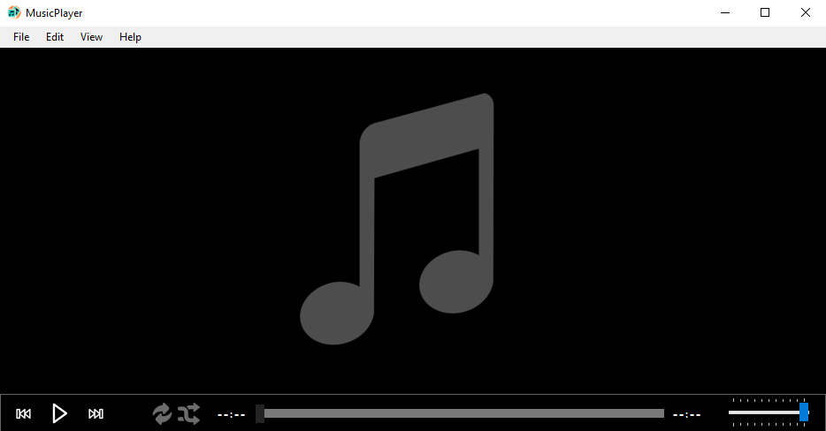
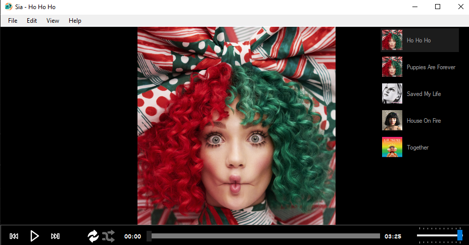
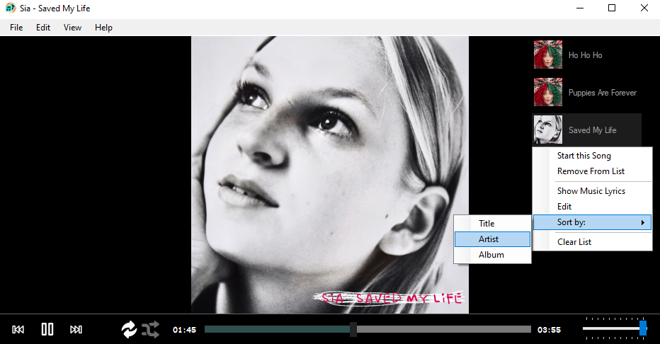
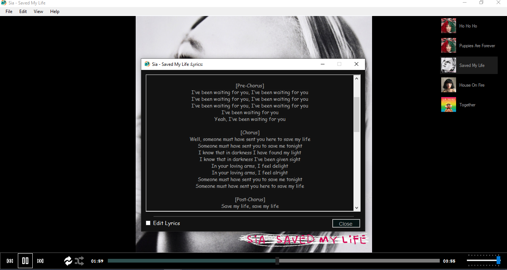
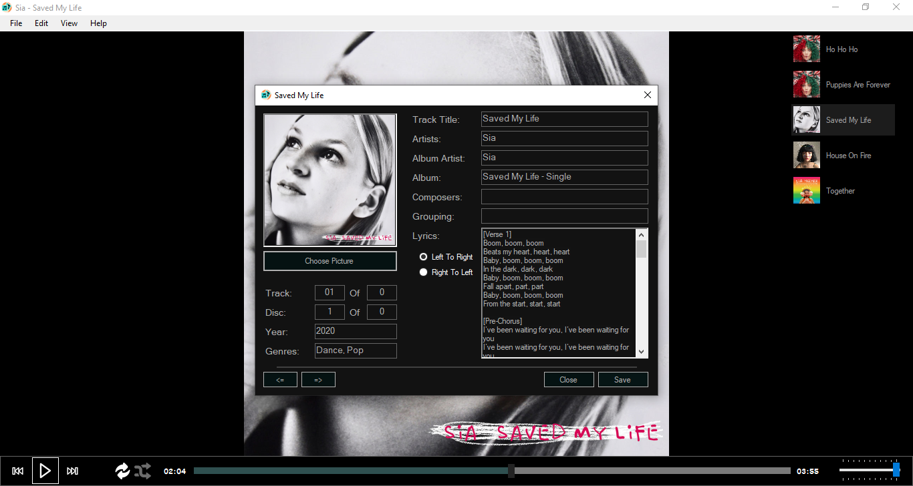

  
  <h1>MusicPlayer</h1>

  <h4>
    <a href="#Features">Features</a> |
    <a href="#Releases">Releases</a> |
    <a href="#Libraries-used">Libraries used</a> |
    <!-- <a href="#Requirements">Requirements</a> | -->
    <a href="#Build-Notes">Build Notes</a> |
    <a href="#Bugs-and-Issues">Bugs and Issues</a> |
    <a href="#Icons">Icons</a> |
    <a href="#Screenshots">Screenshots</a>
  </h4>

**"MusicPlayer"** هو واجد MusicPlayer بسيط كيقرا لك المزيكة، كيقدر يقرا أغلب أنواع الفيشيات ديال المزيكة ()، عطيه غير المزيكو و نمزك ليا مع راسك.

إلا كنتي باغي تقرا هادشي بالإنجليزية <a href="README.md">ورك هنا</a>

## Features
+ كيقرا **mp3**, **m4a**, **ogg** و **wav**
+ تقضر تجل ملف ولا دوسي و هو غايجبد كاع المزيكة لي فيه
+ تقضر تهز شي فيشي ولا دوسي و تلوجو في البروكرام و هو غابقراه
+ تقضر تخليه يخل الفيشيات ديال المزيكة ديركت من الدواصا
+ ممكن تخدم المزيكة مامرتباش و ممكن تعاود غير ديسك واخد
+ تقضر ترتب المزيكة
+ ممكن تبدل المعلومات ديال شي مزيكة

<!-- ## Releases
From time to time I'll build and publish a new pre-release which can be find here:

- [All](#)
- [---](#) -->

## Libraries used
- [NAudio](https://github.com/naudio/NAudio) is an open source .NET audio library written by Mark Heath.
- [TagLib#](https://github.com/mono/taglib-sharp) (aka Taglib-sharp) is a .NET library for reading and writing metadata in media files.

## Requirements
 - .NET Framework v4.7.2
 - [الويندوز](https://en.wikipedia.org/wiki/Microsoft_Windows)

## Build Notes
1. تأكد بلي عندك [هادشي](#Requirements).
2. تيليشارجي عندك هاد البروجي:  `git clone https://github.com/Eddayfy/MusicPlayer.git`
3. دخل لدوسي: `cd MusicPlayer`
4. قلب على 'MSBuild.exe' على جساب VS version لي عندك [شوف هادشي](https://en.wikipedia.org/wiki/MSBuild#Versions)
5. قرا ال 'MSBuild.exe' في هاد البروجي
6. قرا داكشي لي طلع لك غاتلقا فيه فين كاين 'MusicPlayer.exe' أولا كتب هادشي `cd MusicPlayer\bin\Debug\ && MusicPlayer.exe`
4. تمتع ليا مع راسك (ممكن دير هادشي غير من الفيديال ستوديو)

## Bugs and Issues
إلا لقيتي شي مشكل في هادشي، سيفط لينا المشكل [هنا](https://github.com/Eddayfy/MusicPlayer/issues).

## Icons
كاع التصاور واخدهوم من [Flaticon](https://www.flaticon.com/).

## Screenshots

